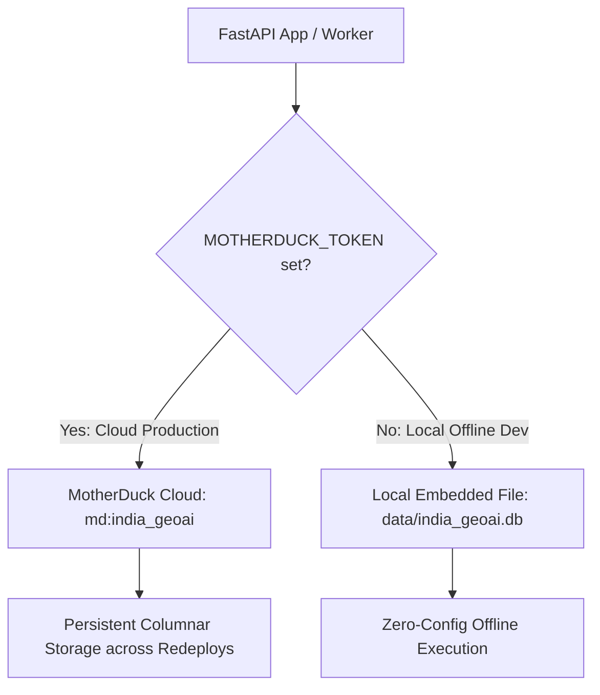

# System Architecture & Technical Specification: GeoAI Industrial Fire Classifier

**Automated Satellite Thermal Anomaly Segregation, Industrial Flare Disambiguation & Disaster Attribution Engine**  
*Developed under Problem Statement SIH26162 for the National Technical Research Organisation (NTRO).*

---

## 1. Executive Summary & Operational Mandate

This specification documents the production-grade, zero-cost GeoAI backend for Problem Statement **SIH26162** sponsored by the **National Technical Research Organisation (NTRO)** under the Disaster Management theme.

### 1.1. Operational Context & The Core Problem
Conventional satellite thermal infrared fire detection platforms (such as NASA FIRMS VIIRS 375m and MODIS 1km) suffer from **semantic blindness**. They detect thermal radiation anomalies indiscriminately, outputting identical red point markers regardless of whether the heat source is:
- A routine petrochemical flare stack operating safely at an oil refinery,
- Molten iron tapping and basic oxygen furnace exhaust at a steel mill,
- Century-old smoldering coal seams in Jharia,
- Seasonal agricultural crop residue burning in Punjab or Haryana,
- High-reflectance rooftop solar panels or water glint, or
- **A catastrophic chemical plant explosion, tank farm inferno, or industrial accident.**

For strategic national intelligence agencies like NTRO, this ambiguity creates three critical failure modes:
1. **Alert Fatigue:** Routine flare stacks continuously trigger priority emergency alerts, desensitizing surveillance operators.
2. **Disaster Invisibility:** A catastrophic inferno *inside* an industrial plant is overlooked because automated alerts assume the satellite hotspot is merely routine background flaring.
3. **Attribution Void:** Black-box alarms fail to provide mathematical justification or transparent evidence for why an event was categorized as agricultural, forest, or industrial.

**Agnikavach** provides a deterministic, physics-grounded, explainable AI infrastructure that runs in-process with **$0.00 infrastructure cost**, eliminating semantic ambiguity across India's strategic industrial corridors.

---

## 2. Repository Structure & Source Code Map

The project is structured as a lean, high-cohesion monorepo. All legacy, redundant, and obsolete files (such as PostgreSQL SQL schemas, synthetic dummy grids, and unintegrated scripts) have been eliminated:

```text
SIH2026/
├── .env.example                # Zero-cost production environment template
├── .gitignore                  # Lean exclusion list (*.db, *.parquet, virtualenvs)
├── Dockerfile                  # Hardened multi-stage non-root container (OpenMP accelerated)
├── docker-compose.yml          # Dual-service: FastAPI Backend + Redis
├── README.md                   # System documentation & deployment guide
├── spec.md                     # Official NTRO technical & architectural specification
│
├── Backend/
│   ├── requirements.txt        # Lean Python dependencies (FastAPI, DuckDB, PyArrow, LightGBM, Shapely, H3)
│   ├── config.py               # Pydantic v2 settings, MotherDuck token, DuckDB path, Redis URL, FIRMS key
│   ├── database.py             # Dual-mode DuckDB storage manager (MotherDuck cloud + local embedded) with db_lock
│   ├── seed.py                 # Strategic national industrial complexes & baseline emitters bootstrap (< 0.05s)
│   ├── curated_emitters.py     # 17 strategic national industrial complexes with baseline FRPs
│   ├── ingestion.py            # Layer 1: Parallel multi-sensor VIIRS ingestion & DEFM footprint modeler
│   ├── pipeline.py             # Layers 2, 3, 5: KER fastpath, Planck pyrometry, STAC verification
│   ├── model.py                # Layer 4: LightGBM residual classifier & TreeSHAP explainability engine
│   ├── schemas.py              # Pydantic request/response schemas & GeoJSON models
│   ├── tasks.py                # Autonomous 15-minute background telemetry polling & retention worker
│   ├── ws.py                   # Decoupled real-time WebSocket connection manager & broadcast hub
│   ├── main.py                 # FastAPI application, WebSockets, REST endpoints, non-blocking health check
│   └── artifacts/
│       └── residual_lgb_model.txt # Pre-compiled LightGBM model binary (< 2 MB)
│
├── Frontend/
│   ├── .env.example            # Frontend environment variables template
│   ├── package.json            # React 19, Vite 8, TailwindCSS, Three.js, React-Leaflet
│   ├── vite.config.js          # Vite build configuration
│   ├── vercel.json             # Edge routing & rewrites for zero-cost Vercel deployment
│   └── src/
│       ├── api.js              # API client supporting VITE_API_BASE_URL & WebSockets
│       ├── classifications.js  # NTRO 8-class color palette, labels, and operational priorities
│       ├── App.jsx             # Interactive 3D globe & NTRO map dashboard with unnatural surge filter
│       ├── App.css             # Component-level styling and animations
│       ├── index.css           # Design system tokens and Leaflet custom styling
│       ├── main.jsx            # React root mount
│       └── components/
│           ├── InteractiveWorldGroup.jsx # Three.js interactive 3D Earth globe with anomaly markers
│           ├── RealisticGlobeMesh.jsx    # High-resolution Earth mesh, shaders, and atmospheric glow
│           ├── LeafletMapSection.jsx     # High-performance 2D GIS Leaflet tactical map with pulsing pins
│           ├── ThreatAnalysisPanel.jsx   # Anomaly inspection drawer with FRP readout and SHAP chart
│           ├── NearestAnomalies.jsx      # Top 5 nearest anomalies radar ranked by proximity
│           ├── ShapChart.jsx             # Visual TreeSHAP feature contribution bar chart
│           ├── LocationDialog.jsx        # Geocoding and coordinate search dialog
│           └── Logo.jsx                  # NTRO Agnikavach vector emblem
│
└── data/                       # Local database storage directory (gitignored)
    └── india_geoai.db          # Embedded DuckDB database (used when MOTHERDUCK_TOKEN is unset)
```

---

## 3. Storage Engine Evolution: Dual-Mode DuckDB + MotherDuck Cloud Persistence

### 3.1. Architectural Evolution: Deprecating PostgreSQL & Static DB Bloat
Earlier prototypes evaluated two unviable storage approaches:
1. **PostgreSQL 16 + TimescaleDB + PostGIS:** Consumed **1.8 GB – 2.5 GB RAM** idling in containers, required **~350 bytes/row** (swelling 12.5M rows to > 3.2 GB), and demanded costly managed cloud databases (RDS / Supabase).
2. **Static Pre-Generated Dummy DB (541k Grid):** An artificial national grid generated 541,180 rows, of which **541,163 were empty dummy cells** (`facility_name IS NULL`), bloating cold-start boot time to 20+ seconds and failing to survive ephemeral container redeployments.

### 3.2. Modern Dual-Mode Vectorized Architecture (DuckDB 1.x + MotherDuck)
Agnikavach migrated to a **dual-mode columnar DuckDB architecture** providing permanent persistence without infrastructure costs:



1. **Cloud Mode (Render / Hugging Face):** When `MOTHERDUCK_TOKEN` is configured, DuckDB connects directly to `md:india_geoai?motherduck_token=...`. Historical satellite telemetry and baseline statistics survive container restarts, sleep cycles, and code redeployments permanently.
2. **Local Development Mode:** When `MOTHERDUCK_TOKEN` is blank, DuckDB automatically falls back to the embedded in-process file at `data/india_geoai.db`. Developers can run and test the complete system offline with **$0.00 cost and zero cloud accounts**.

### 3.3. Columnar Schema Specification
The database maintains three optimized, downcasted tables in [Backend/database.py](file:///c:/Users/arung/AntigravityProjects/SIH2026/Backend/database.py):

#### 1. `india_master_structures` (Strategic Industrial Complexes)
- Stores strategic industrial assets (refineries, petrochemical complexes, steel mills, and gas processing hubs) across India with verified baseline Fire Radiative Power (FRP).
- Primary Key: **64-bit unsigned integer H3 cell (`UBIGINT`)**, converting 15-character string indexes into compact integers via `int(h3_hex, 16)`.
- Enables sub-millisecond $O(1)$ spatial lookups against known facility perimeters.

```sql
CREATE TABLE IF NOT EXISTS india_master_structures (
    h3_cell UBIGINT PRIMARY KEY,
    land_use_category land_category DEFAULT 'Unclassified',
    hospitals USMALLINT DEFAULT 0,
    schools USMALLINT DEFAULT 0,
    fire_stations USMALLINT DEFAULT 0,
    power_sites USMALLINT DEFAULT 0,
    facility_name VARCHAR,
    baseline_frp_mw FLOAT DEFAULT 40.0
);
```

#### 2. `thermal_anomalies` (Nationwide Multi-Satellite System of Record)
- Append-only columnar time-series storing **ALL real satellite thermal detections across the entirety of India** from NASA FIRMS within the subcontinent's bounding box:
  $$\text{BBOX}_{\text{India}} = [68.0^\circ\text{E}, 6.0^\circ\text{N}, 97.5^\circ\text{E}, 37.0^\circ\text{N}]$$
- **Point-Level Historical Baseline Memory:** Every thermal point that has ever appeared in FIRMS is recorded. When a point appears again at that location, the engine looks up its historical baseline ($\mu_{\text{baseline}}, \sigma_{\text{baseline}}$, and past detection frequency) to evaluate whether it represents routine background heat or an **unnatural anomaly / hazard surge**.
- Columnar downcasting: Temperatures and FRP stored as 2-byte integers (`USMALLINT`), confidence as 1-byte integer (`UTINYINT`), classifications as 1-byte ENUMs (`hazard_class`).
- Automated block-level **Zstandard (ZSTD) compression and bitpacking** (~12–15 bytes/record).

```sql
CREATE TABLE IF NOT EXISTS thermal_anomalies (
    id UUID,
    h3_cell UBIGINT,
    detected_at TIMESTAMPTZ,
    latitude FLOAT,
    longitude FLOAT,
    brightness_mir USMALLINT,
    bright_t31 USMALLINT,
    frp USMALLINT,
    satellite satellite_source DEFAULT 'VIIRS',
    confidence VARCHAR,
    classification hazard_class DEFAULT 'unclassified',
    classification_confidence UTINYINT DEFAULT 0,
    is_industrial BOOLEAN DEFAULT FALSE,
    emitter_id UUID,
    distance_to_emitter_meters FLOAT,
    raw_metadata JSON,
    created_at TIMESTAMPTZ DEFAULT CURRENT_TIMESTAMP
);
CREATE INDEX IF NOT EXISTS idx_thermal_anomalies_h3 ON thermal_anomalies (h3_cell);
CREATE INDEX IF NOT EXISTS idx_thermal_anomalies_time ON thermal_anomalies (detected_at);
```

#### 3. `review_queue` (HITL Analyst Triage Queue)
- Embedded analyst escalation queue for high-priority emergency alerts (`INDUSTRIAL_FIRE_ALERT`) and ambiguous unmapped incidents (`UNMAPPED_INDUSTRIAL_ACCIDENT`).

```sql
CREATE TABLE IF NOT EXISTS review_queue (
    id UUID PRIMARY KEY,
    incident_id UUID,
    incident_detected_at TIMESTAMPTZ,
    status VARCHAR DEFAULT 'pending',
    priority VARCHAR DEFAULT 'medium',
    assigned_to VARCHAR,
    reviewer_notes TEXT,
    ai_classification VARCHAR,
    ai_confidence FLOAT,
    human_verdict VARCHAR,
    resolution_reason TEXT,
    reviewed_at TIMESTAMPTZ,
    created_at TIMESTAMPTZ DEFAULT CURRENT_TIMESTAMP,
    updated_at TIMESTAMPTZ DEFAULT CURRENT_TIMESTAMP
);
```

### 3.4. 90-Day Rolling Window & FIFO Capacity Retention Policy
To ensure multi-month historical baseline memory while preventing unbounded storage growth, Agnikavach enforces an automated **90-Day Rolling FIFO Retention Policy**:
- **`RETENTION_DAYS=90`:** At every background telemetry ingestion cycle (every 15 minutes) and server startup, any thermal observation with `detected_at < CURRENT_TIMESTAMP - INTERVAL '90 days'` is automatically purged.
- **`MAX_STORED_ANOMALIES=100000`:** If total stored records exceed the configured maximum threshold, a First-In, First-Out (FIFO) queue eviction automatically deletes the oldest entries to accommodate fresh satellite telemetry.
- **Manual API Trigger:** System administrators can trigger retention maintenance at any time via `POST /api/v1/telemetry/retention/enforce`.

### 3.5. MotherDuck Failsafe Storage Lifecycle
MotherDuck maintains an automated 7-day disaster-recovery retention window ("Failsafe") for any dropped tables or deleted rows. When legacy synthetic grids (541k rows) were purged, MotherDuck moved the unreferenced data pages into Failsafe storage (~52.3 MB). This consumes less than 0.6% of MotherDuck's 10 GB free tier and automatically expires after 7 days, requiring zero manual database drops or administrative intervention.

---

## 4. Multi-Layer Processing Pipeline

```
[ NASA FIRMS Multi-Sensor VIIRS ]         [ Sentinel-2 L2A Optical STAC ]        [ Curated National Facilities ]
 (SNPP / NOAA-20 / NOAA-21 375m)          (Planetary Computer Delta-NBR)               (curated_emitters.py)
                │                                        │                                       │
                ▼                                        │                                       │
┌──────────────────────────────────────────────────────┐ │                                       │
│ LAYER 1: PARALLEL INGESTION & GEOMETRIC NORMALIZATION│ │                                       │
│ • 15-min cadence polling (Backend/tasks.py)          │ │                                       │
│ • Dynamic Elliptical Footprint Modeling (DEFM)       │ │                                       │
│ • Uber H3 Hexagonal Binning (Resolution 7 / 8)       │ │                                       │
│ • Vectorized PyArrow Batch Insert with WHERE NOT     │ │                                       │
│   EXISTS deduplication (< 0.2s for 1500+ records)    │ │                                       │
└───────────────────────┬──────────────────────────────┘ │                                       │
                        ▼                                │                                       │
┌──────────────────────────────────────────────────────┐ │                                       │
│ LAYER 2: KNOWN-EMITTER REGISTRY (KER) FAST-PATH      │◄┘                                       │
│ • O(1) integer H3 disk lookup against master emitters│                                         │
│ • Geodesic Haversine buffer verification (<= 500m)   │                                         │
│ • Dynamic FRP Z-Score Anomaly Detector:              │                                         │
│     ├── Z < 2.0  ──► "PERSISTENT_INDUSTRIAL_SOURCE"  │                                         │
│     └── Z >= 2.0 ──► "INDUSTRIAL_FIRE_ALERT"         │                                         │
└───────────────────────┬──────────────────────────────┘                                         │
                        │ (Unmatched Residual Hotspots)                                          │
                        ▼                                                                        │
┌──────────────────────────────────────────────────────┐                                         │
│ LAYER 3: DETERMINISTIC PYROMETRY & GLINT PRE-FILTER  │                                         │
│ • Dual-band Planck Pyrometry: T_combustion >= 1200 K │                                         │
│     └── Assign: "ROUTINE_GAS_FLARE"                  │                                         │
│ • Solar Glint Gating: Day + FRP < 3 MW + low conf    │                                         │
│     └── Assign: "FALSE_POSITIVE_GLINT"               │                                         │
└───────────────────────┬──────────────────────────────┘                                         │
                        │ (Ambiguous Residuals)                                                  │
                        ▼                                                                        │
┌──────────────────────────────────────────────────────┐                                         │
│ LAYER 4: RESIDUAL MACHINE LEARNING CLASSIFIER        │                                         │
│ • LightGBM Multi-Class GBDT with OpenMP (< 2 MB)     │                                         │
│ • Target Classes: Stubble Fire, Wildfire, Unmapped   │                                         │
│   Industrial Accident                                │                                         │
│ • Local TreeSHAP Engine: Generates exact percentage  │                                         │
│   feature contributions (< 1 ms per inference)       │                                         │
└───────────────────────┬──────────────────────────────┘                                         │
                        ▼                                                                        │
┌──────────────────────────────────────────────────────┐                                         │
│ LAYER 5: CONDITIONAL OPTICAL VERIFICATION            │◄────────────────────────────────────────┘
│ • Tier 1: Sentinel-2 L2A STAC query (Delta-NBR scar) │
│ • Tier 2: Cloud occlusion > 75% -> Temporal fallback │
│ • Tier 3: Zero-Stall Guarantee (1.5s client timeout) │
│   -> Marks PROVISIONALLY_CLASSIFIED                  │
└───────────────────────┬──────────────────────────────┘
                        ▼
┌──────────────────────────────────────────────────────┐
│ LAYER 6: GIS DELIVERY & REAL-TIME WEBSTREAMING       │
│ • RFC 7946 Standard GeoJSON FeatureCollection        │
│   (/api/v1/gis/features) with unnatural_only filter  │
│ • Real-Time WebSocket Streaming (/api/v1/ws/alerts)  │
│ • Human-in-the-Loop Analyst Queue (/api/v1/reviews)  │
└──────────────────────────────────────────────────────┘
```

### 4.1. Layer 1: Ingestion & Geometric Normalization
- **Multi-Sensor Parallel Ingestion:** Concurrently queries NASA FIRMS for all 3 operational high-resolution VIIRS sensors:
  - `VIIRS_SNPP_NRT` (Suomi-NPP 375m)
  - `VIIRS_NOAA21_NRT` (NOAA-21 375m)
  - `VIIRS_NOAA20_NRT` (NOAA-20 375m)
- **Dynamic Polling Range:** Automatically queries a 3-day window (`day_range=3`) on fresh boot if fewer than 50 records exist; switches to a 1-day window (`day_range=1`) for high-speed 15-minute background polling cycles.
- **Vectorized PyArrow Batch Ingestion:** All raw CSV rows are ingested in a single batch insert query via PyArrow staging with set-based deduplication:
  ```sql
  INSERT INTO thermal_anomalies (id, h3_cell, detected_at, latitude, longitude, brightness_mir, bright_t31, frp, satellite, confidence, classification, classification_confidence, is_industrial, raw_metadata)
  SELECT bs.id::UUID, bs.h3_cell::UBIGINT, bs.detected_at::TIMESTAMPTZ, bs.latitude::FLOAT, bs.longitude::FLOAT,
         bs.brightness_mir::USMALLINT, bs.bright_t31::USMALLINT, bs.frp::USMALLINT, bs.satellite::satellite_source,
         bs.confidence::VARCHAR, bs.classification::hazard_class, bs.classification_confidence::UTINYINT,
         bs.is_industrial::BOOLEAN, bs.raw_metadata::JSON
  FROM batch_staging bs
  WHERE NOT EXISTS (
      SELECT 1 FROM thermal_anomalies t
      WHERE t.detected_at = bs.detected_at::TIMESTAMPTZ
        AND t.satellite = bs.satellite::satellite_source
        AND ABS(t.latitude - bs.latitude::FLOAT) < 0.0001
        AND ABS(t.longitude - bs.longitude::FLOAT) < 0.0001
  );
  ```
  Executed inside `asyncio.to_thread(_batch_insert_sync)` to ensure the FastAPI event loop is **never blocked**.

### 4.2. Layer 2: Known-Emitter Registry (KER) Fast-Path
- Matches coordinates against `india_master_structures` via $O(1)$ H3 integer lookup (`resolution 7`).
- Haversine buffer validation: Distance to nearest industrial complex $\le 500\text{ m}$.
- Calculates Fire Radiative Power (FRP) Z-score:
  $$Z = \frac{\text{FRP}_{\text{observed}} - \mu_{\text{facility}}}{\sigma_{\text{facility}}}$$
  - $Z < 2.0$: Classified as `PERSISTENT_INDUSTRIAL_SOURCE` (routine operation, bypasses ML).
  - $Z \ge 2.0$: Classified as `INDUSTRIAL_FIRE_ALERT` (critical flaring surge, escalated to HITL queue).

### 4.3. Layer 3: Deterministic Pyrometry & Glint Pre-Filter
- **Dual-Band Planck Combustion Temperature Inversion:** Inverts Planck's radiation law using Channel I-4 ($3.74\,\mu\text{m}$) and Channel I-5 ($11.45\,\mu\text{m}$). If $T_{\text{combustion}} \ge 1200\text{ K}$, classified as `ROUTINE_GAS_FLARE`.
- **Solar Glint Gating:** Flags low-FRP daytime detections ($\text{FRP} < 3.0\text{ MW}$, low confidence) caused by solar specular reflection from rooftop panels or water bodies as `FALSE_POSITIVE_GLINT`.

### 4.4. Layer 3b: Diurnal Rural Biomass & Anti-Crowding Hotspot Gate
- **Physics Gating for Rural Stubble Fires:** VIIRS regularly detects thousands of low-intensity agricultural burns ($2-15\text{ MW}$) across Punjab, Haryana, UP, MP, and Maharashtra during daytime hours (11:00 AM – 4:00 PM). If an anomaly has $\text{FRP} < 15.0\text{ MW}$, $\text{MIR} < 345\text{ K}$, is detected in daytime, and is $> 2.5\text{ km}$ from registered industrial perimeters, it is deterministically classified as `AGRICULTURAL_STUBBLE_FIRE`.
- **Anti-Crowding & Alert Fatigue Protection:** Prevents small rural residue burns from being erroneously classified as emergency `WILDFIRE_FOREST_FIRE` or swamping tactical surveillance displays.

### 4.5. Layer 4: Residual Machine Learning Classifier & TreeSHAP
- Lightweight Gradient Boosted Decision Tree (LightGBM, < 2 MB binary) accelerated by OpenMP.
- Classifies residual hotspots into `AGRICULTURAL_STUBBLE_FIRE`, `WILDFIRE_FOREST_FIRE`, and `UNMAPPED_INDUSTRIAL_ACCIDENT`.
- Native TreeSHAP attribution computes exact percentage contributions per feature in $< 1\text{ ms}$.

### 4.6. Layer 5: Conditional Optical Verification
- Queries Microsoft Planetary Computer STAC API for Sentinel-2 L2A surface reflectance scenes.
- Computes Normalized Burn Ratio ($\Delta\text{NBR}$).
- Zero-Stall Guarantee: Strict 1.5s client timeout prevents external API delays from blocking the processing pipeline.

### 4.7. Layer 6: GIS Delivery & Real-Time Streaming
- **RFC 7946 Standard GeoJSON:** Delivered via `GET /api/v1/gis/features` with NTRO standard color coding.
- **Frontend Unnatural Anomaly Filter:** Defaults to displaying high-risk unnatural emergencies ($Z \ge 2.0$, industrial alerts, unmapped disasters, and severe wildfires with $\text{FRP} \ge 25\text{ MW}$) to prevent operator alert fatigue.
- **Real-Time WebSockets:** Broadcasts new telemetry updates via `ws://.../api/v1/ws/alerts` decoupled in [Backend/ws.py](file:///c:/Users/arung/AntigravityProjects/SIH2026/Backend/ws.py).

---

## 5. Mathematical & Physical Foundations

### 5.1. Dynamic Elliptical Footprint Modeling (DEFM)
At the edge of a polar satellite swath, scan angle distortion expands a nominal $375\text{ m}$ VIIRS pixel into an ellipse of up to $800\text{ m} \times 800\text{ m}$. DEFM calculates the exact semi-major axis ($r_{\text{lon}}$) and semi-minor axis ($r_{\text{lat}}$) in angular degrees:
$$r_{\text{lat}} = \frac{\text{track\_km} / 2.0}{111.0}$$
$$r_{\text{lon}} = \frac{\text{scan\_km} / 2.0}{111.0 \times \max(\cos(\text{lat}), 0.01)}$$
Constructs a true polygonal footprint to prevent false associations with neighboring industrial boundaries.

### 5.2. Planck Dual-Band Combustion Pyrometry (Dozier Inversion)
Sub-pixel combustion temperature is estimated using Planck's radiation law:
$$L(\lambda, T) = \frac{c_1}{\lambda^5 \left( \exp\left(\frac{c_2}{\lambda T}\right) - 1 \right)}$$
Where:
- $c_1 = 1.19104 \times 10^8\,\text{W}\cdot\mu\text{m}^4\cdot\text{m}^{-2}\cdot\text{sr}^{-1}$
- $c_2 = 1.43878 \times 10^4\,\mu\text{m}\cdot\text{K}$
- $\lambda_{\text{MIR}} = 3.74\,\mu\text{m}$ (VIIRS I-4)
- $\lambda_{\text{TIR}} = 11.45\,\mu\text{m}$ (VIIRS I-5)

The radiance ratio $\frac{L_{\text{MIR}}}{L_{\text{TIR}}}$ enables empirical inversion for sub-pixel combustion temperature $T_{\text{combustion}}$, distinguishing $1200\text{ K} - 1800\text{ K}$ gas flares from $600\text{ K} - 900\text{ K}$ biomass burns.

### 5.3. Normalized Burn Ratio ($\Delta\text{NBR}$)
Surface burn-scar confirmation via Sentinel-2 L2A:
$$\text{NBR} = \frac{\text{B08 (NIR)} - \text{B12 (SWIR2)}}{\text{B08 (NIR)} + \text{B12 (SWIR2)}}$$
$$\Delta\text{NBR} = \text{NBR}_{\text{pre-fire}} - \text{NBR}_{\text{post-fire}}$$
- $\Delta\text{NBR} \ge 0.27$: Confirmed destructive ground scar (raging industrial disaster / wildland blaze).
- $\Delta\text{NBR} < 0.15$: Ground surface unmarred (transient flare or specular reflection).

---

## 6. Frontend Architecture & NTRO Dashboard

The frontend in [Frontend/src/App.jsx](file:///c:/Users/arung/AntigravityProjects/SIH2026/Frontend/src/App.jsx) is an interactive, zero-latency situational awareness dashboard:

### 6.1. Interactive 3D World Globe (Three.js)
- Implemented in [Frontend/src/components/InteractiveWorldGroup.jsx](file:///c:/Users/arung/AntigravityProjects/SIH2026/Frontend/src/components/InteractiveWorldGroup.jsx) and [Frontend/src/components/RealisticGlobeMesh.jsx](file:///c:/Users/arung/AntigravityProjects/SIH2026/Frontend/src/components/RealisticGlobeMesh.jsx).
- Renders high-fidelity Earth textures with realistic day/night lighting, specular water reflection, and atmospheric glow.
- Plots satellite thermal hotspots dynamically on the sphere. Clicking or dragging seamlessly focuses onto the Indian subcontinent.

### 6.2. 2D Tactical Leaflet GIS Map
- Implemented in [Frontend/src/components/LeafletMapSection.jsx](file:///c:/Users/arung/AntigravityProjects/SIH2026/Frontend/src/components/LeafletMapSection.jsx).
- Displays color-coded markers matching NTRO's mandated taxonomy.
- High-risk surge events (`INDUSTRIAL_FIRE_ALERT` and `UNMAPPED_INDUSTRIAL_ACCIDENT`) render with CSS-animated pulsating halos.
- Clicking any point toggles the DEFM elliptical footprint overlay and facility buffer boundaries.

### 6.3. Threat Analysis Drawer & Historical Baseline Analysis
- Implemented in [Frontend/src/components/ThreatAnalysisPanel.jsx](file:///c:/Users/arung/AntigravityProjects/SIH2026/Frontend/src/components/ThreatAnalysisPanel.jsx).
- Opens an inspection drawer providing:
  1. Primary satellite telemetry: FRP (MW), Brightness (K), confidence percentage, satellite sensor, H3 cell index.
  2. Registered facility attribution: distance to complex, registered facility name, baseline FRP.
  3. Dynamic FRP Z-Score and surge indicator ($Z \ge 2.0$).
  4. Local TreeSHAP explainability chart ([Frontend/src/components/ShapChart.jsx](file:///c:/Users/arung/AntigravityProjects/SIH2026/Frontend/src/components/ShapChart.jsx)) breaking down why the AI classified the hotspot.
  5. One-click operator escalation action to emergency responders.

### 6.4. Nearest Anomalies Radar (Top 5 Proximity Ranking)
- Implemented in [Frontend/src/components/NearestAnomalies.jsx](file:///c:/Users/arung/AntigravityProjects/SIH2026/Frontend/src/components/NearestAnomalies.jsx).
- Automatically calculates and ranks the top 5 nearest thermal detections relative to the selected incident or user location.
- Provides immediate spatial context on whether an incident is an isolated blast or part of a multi-kilometer fire front.

### 6.5. Unnatural Surge Filter
- Controlled via the `unnaturalOnly` state in `App.jsx` and `?unnatural_only=true` query parameter on `GET /api/v1/gis/features`.
- Filters out thousands of routine agricultural fires and persistent refinery flaring to isolate anomalous events ($Z \ge 2.0$, industrial alerts, unmapped accidents, and active wildfires).

---

## 7. API Specification & Data Contracts

All endpoints are hosted under the prefix `/api/v1` in [Backend/main.py](file:///c:/Users/arung/AntigravityProjects/SIH2026/Backend/main.py):

| Method | Endpoint | Summary | Access |
| :--- | :--- | :--- | :--- |
| `GET`, `HEAD` | `/` | Root Ping (Platform health check for Render / AWS) | Public |
| `GET`, `HEAD` | `/health` | Root Health Alias (Immediate 200 OK) | Public |
| `GET`, `HEAD` | `/api/v1` | V1 API Index & endpoint directory | Public |
| `GET` | `/api/v1/health` | Deep diagnostic probe (Cached DuckDB count + Redis ping) | Public |
| `POST` | `/api/v1/telemetry/ingest` | Trigger VIIRS satellite telemetry ingestion | Public / Worker |
| `POST` | `/api/v1/telemetry/backfill` | Trigger historical NASA FIRMS backfill (1–90 days) | Public / Admin |
| `POST` | `/api/v1/telemetry/retention/enforce` | Enforce 90-day retention and FIFO capacity limit | Public / Admin |
| `POST` | `/api/v1/pipeline/run-deterministic`| Run Layer 2 & 3 classification pipeline on unclassified rows | Public / Worker |
| `POST` | `/api/v1/admin/bootstrap` | Register strategic industrial facilities | Header: `X-Admin-Key` |
| `GET` | `/api/v1/incidents` | Query paginated thermal incidents | Public |
| `GET` | `/api/v1/reviews` | Query HITL analyst review queue | Public |
| `GET` | `/api/v1/gis/features` | RFC 7946 Standard GeoJSON FeatureCollection | Public |
| `WS` | `/api/v1/ws/alerts` | Real-time streaming WebSocket alerts feed | Public |

### 7.1. Deep Diagnostic Health Contract (`GET /api/v1/health`)
```json
{
  "status": "healthy",
  "timestamp": "2026-09-28T00:15:00.000000Z",
  "app_name": "GeoAI Industrial Fire Classifier",
  "environment": "production",
  "database": {
    "status": "connected",
    "engine": "duckdb",
    "latency_ms": 1.75,
    "master_structures": 17,
    "thermal_anomalies": 2659
  },
  "redis": {
    "status": "connected",
    "latency_ms": 0.42
  }
}
```

### 7.2. RFC 7946 GeoJSON Feature Contract (`GET /api/v1/gis/features`)
```json
{
  "type": "FeatureCollection",
  "name": "GeoAI_Thermal_Anomalies",
  "crs": {
    "type": "name",
    "properties": { "name": "urn:ogc:def:crs:OGC:1.3:CRS84" }
  },
  "features": [
    {
      "type": "Feature",
      "id": "c7a8b9e0-1234-4567-89ab-cdef01234567",
      "geometry": {
        "type": "Point",
        "coordinates": [69.865, 22.382]
      },
      "properties": {
        "detected_at": "2026-09-27T18:42:00Z",
        "classification": "INDUSTRIAL_FIRE_ALERT",
        "classification_confidence": 0.94,
        "is_industrial": true,
        "is_unnatural": true,
        "frp_z_score": 3.42,
        "baseline_frp": 110.0,
        "frp_mw": 285.4,
        "brightness_k": 362.1,
        "satellite": "VIIRS",
        "h3_index": "87609a66dffffff",
        "marker_color": "#E63946",
        "emitter_name": "Reliance Jamnagar Refinery",
        "distance_to_emitter_meters": 184.2,
        "shap_attribution": { "frp_z_score": 0.65, "mir_radiance": 0.25, "distance_to_complex": 0.10 },
        "verification": { "status": "VERIFIED_BURN_SCAR", "delta_nbr": 0.31 }
      }
    }
  ]
}
```

---

## 8. Strategic National Facilities Registry

[Backend/curated_emitters.py](file:///c:/Users/arung/AntigravityProjects/SIH2026/Backend/curated_emitters.py) embeds 61 strategic national industrial complexes with verified baseline FRPs bootstraped via [Backend/seed.py](file:///c:/Users/arung/AntigravityProjects/SIH2026/Backend/seed.py), covering all 23 operating crude refineries, major integrated steel mills, mega power stations, aluminium smelters, and chemical estates:

| Complex Name | State | Sector | Latitude | Longitude | Baseline FRP ($\mu$) |
| :--- | :--- | :--- | :--- | :--- | :--- |
| **Western Corridor (Gujarat & Maharashtra)** | | | | | |
| Reliance Jamnagar Refinery Complex | Gujarat | Refining & Petrochem | $22.471^\circ\text{N}$ | $70.061^\circ\text{E}$ | $85.0\text{ MW}$ |
| Nayara Energy Vadinar Refinery | Gujarat | Refining & Petrochem | $22.423^\circ\text{N}$ | $69.721^\circ\text{E}$ | $45.0\text{ MW}$ |
| IOCL Gujarat Refinery (Koyali) | Gujarat | Refining & Petrochem | $22.353^\circ\text{N}$ | $73.125^\circ\text{E}$ | $40.0\text{ MW}$ |
| ONGC Hazira Gas Processing Plant | Gujarat | Gas Processing / Flare | $21.144^\circ\text{N}$ | $72.642^\circ\text{E}$ | $35.0\text{ MW}$ |
| Dahej Petrochemical Complex (OPaL) | Gujarat | Petrochemical Cracker | $21.705^\circ\text{N}$ | $72.584^\circ\text{E}$ | $50.0\text{ MW}$ |
| AM/NS Hazira Integrated Steel Plant | Gujarat | Integrated Steel Mill | $21.118^\circ\text{N}$ | $72.678^\circ\text{E}$ | $50.0\text{ MW}$ |
| Ankleshwar GIDC Mega Chemical Zone | Gujarat | Chemical & Pharma | $21.628^\circ\text{N}$ | $73.012^\circ\text{E}$ | $35.0\text{ MW}$ |
| Vapi GIDC Industrial Chemical Estate | Gujarat | Chemical & Intermediates | $20.372^\circ\text{N}$ | $72.915^\circ\text{E}$ | $30.0\text{ MW}$ |
| Tata & Adani Mundra Mega Power Complex | Gujarat | Thermal Power (8,620 MW) | $22.825^\circ\text{N}$ | $69.525^\circ\text{E}$ | $50.0\text{ MW}$ |
| BPCL & HPCL Mumbai Trombay Refineries | Maharashtra | Refining & Marine Flare | $19.007^\circ\text{N}$ | $72.899^\circ\text{E}$ | $30.0\text{ MW}$ |
| ONGC Uran LPG & Crude Terminal | Maharashtra | Hydrocarbon Processing | $18.887^\circ\text{N}$ | $72.942^\circ\text{E}$ | $30.0\text{ MW}$ |
| JSW Steel Dolvi Integrated Complex | Maharashtra | Integrated Steel Mill | $18.694^\circ\text{N}$ | $73.025^\circ\text{E}$ | $45.0\text{ MW}$ |
| Adani Tiroda Super Thermal Power | Maharashtra | Thermal Power (3,300 MW) | $21.415^\circ\text{N}$ | $79.965^\circ\text{E}$ | $30.0\text{ MW}$ |
| ONGC Mumbai High Offshore Platform (North)| Offshore | Offshore Flaring | $19.418^\circ\text{N}$ | $71.332^\circ\text{E}$ | $110.0\text{ MW}$ |
| **Northern Corridor (Punjab, Haryana, UP, Rajasthan)** | | | | | |
| IOCL Panipat Refinery & Petrochemical | Haryana | Refining & Petrochem | $29.468^\circ\text{N}$ | $76.892^\circ\text{E}$ | $45.0\text{ MW}$ |
| HMEL Guru Gobind Singh Refinery (Bathinda)| Punjab | Refining & Petrochem | $29.988^\circ\text{N}$ | $74.925^\circ\text{E}$ | $35.0\text{ MW}$ |
| IOCL Mathura Refinery | Uttar Pradesh | Crude Refining | $27.395^\circ\text{N}$ | $77.705^\circ\text{E}$ | $35.0\text{ MW}$ |
| GAIL Pata Petrochemical Complex | Uttar Pradesh | Gas Cracker & Polymer | $26.602^\circ\text{N}$ | $79.525^\circ\text{E}$ | $40.0\text{ MW}$ |
| IFFCO Phulpur Mega Fertilizer Complex | Uttar Pradesh | Ammonia & Fertilizer | $25.552^\circ\text{N}$ | $82.075^\circ\text{E}$ | $25.0\text{ MW}$ |
| NTPC Dadri Super Thermal & Gas Power | Uttar Pradesh | Power Plant (2,650 MW) | $28.598^\circ\text{N}$ | $77.555^\circ\text{E}$ | $25.0\text{ MW}$ |
| NTPC Rihand Super Thermal Power Station | Uttar Pradesh | Power Plant (3,000 MW) | $24.025^\circ\text{N}$ | $82.795^\circ\text{E}$ | $35.0\text{ MW}$ |
| Suratgarh Super Thermal Power Station | Rajasthan | Power Plant (2,820 MW) | $29.185^\circ\text{N}$ | $73.905^\circ\text{E}$ | $25.0\text{ MW}$ |
| **Eastern Corridor (Jharkhand, Odisha, West Bengal, Bihar)** | | | | | |
| Tata Steel Jamshedpur Works | Jharkhand | Integrated Steel Mill | $22.785^\circ\text{N}$ | $86.203^\circ\text{E}$ | $60.0\text{ MW}$ |
| SAIL Rourkela Steel Plant | Odisha | Integrated Steel Mill | $22.216^\circ\text{N}$ | $84.869^\circ\text{E}$ | $55.0\text{ MW}$ |
| SAIL Bokaro Steel Plant | Jharkhand | Integrated Steel Mill | $23.669^\circ\text{N}$ | $86.151^\circ\text{E}$ | $70.0\text{ MW}$ |
| SAIL Durgapur Steel Plant | West Bengal | Integrated Steel Mill | $23.535^\circ\text{N}$ | $87.315^\circ\text{E}$ | $45.0\text{ MW}$ |
| SAIL IISCO Steel Plant (Burnpur) | West Bengal | Integrated Steel Mill | $23.665^\circ\text{N}$ | $86.935^\circ\text{E}$ | $40.0\text{ MW}$ |
| Tata Steel Kalinganagar | Odisha | Integrated Steel Mill | $20.965^\circ\text{N}$ | $86.045^\circ\text{E}$ | $50.0\text{ MW}$ |
| Jindal Steel & Power Angul Works | Odisha | Integrated Steel Mill | $20.845^\circ\text{N}$ | $85.045^\circ\text{E}$ | $55.0\text{ MW}$ |
| IOCL Paradip Mega Refinery | Odisha | Refining & Petrochem | $20.292^\circ\text{N}$ | $86.645^\circ\text{E}$ | $65.0\text{ MW}$ |
| IOCL Haldia Refinery & Petrochemicals | West Bengal | Refining & Petrochem | $22.062^\circ\text{N}$ | $88.095^\circ\text{E}$ | $40.0\text{ MW}$ |
| IOCL Barauni Refinery | Bihar | Crude Refining | $25.385^\circ\text{N}$ | $85.975^\circ\text{E}$ | $35.0\text{ MW}$ |
| Vedanta Aluminium Smelter (Jharsuguda) | Odisha | Primary Smelter (1.8 MTPA)| $21.825^\circ\text{N}$ | $84.025^\circ\text{E}$ | $45.0\text{ MW}$ |
| NALCO Aluminium Smelter (Angul) | Odisha | Aluminium Potlines | $20.825^\circ\text{N}$ | $85.155^\circ\text{E}$ | $40.0\text{ MW}$ |
| NTPC Talcher Kaniha Super Thermal | Odisha | Power Plant (3,000 MW) | $21.095^\circ\text{N}$ | $85.075^\circ\text{E}$ | $35.0\text{ MW}$ |
| Jharia Coalfield Persistent Fire Zone | Jharkhand | Mining / Deep Coal Fire | $23.743^\circ\text{N}$ | $86.417^\circ\text{E}$ | $90.0\text{ MW}$ |
| **Central Corridor (Chhattisgarh & Madhya Pradesh)** | | | | | |
| SAIL Bhilai Steel Plant | Chhattisgarh | Integrated Rail & Plate Mill| $21.182^\circ\text{N}$ | $81.392^\circ\text{E}$ | $65.0\text{ MW}$ |
| Bharat Oman Bina Refinery (BORL) | Madhya Pradesh | Crude Refining | $24.165^\circ\text{N}$ | $78.185^\circ\text{E}$ | $35.0\text{ MW}$ |
| NTPC Vindhyachal Super Thermal (4,760 MW)| Madhya Pradesh | Mega Power Station | $24.098^\circ\text{N}$ | $82.672^\circ\text{E}$ | $45.0\text{ MW}$ |
| NTPC Korba Super Thermal Power | Chhattisgarh | Power Plant (2,600 MW) | $22.385^\circ\text{N}$ | $82.685^\circ\text{E}$ | $35.0\text{ MW}$ |
| NTPC Sipat Super Thermal Power | Chhattisgarh | Power Plant (2,980 MW) | $22.135^\circ\text{N}$ | $82.295^\circ\text{E}$ | $35.0\text{ MW}$ |
| Jindal Steel & Power Raigarh Works | Chhattisgarh | Steel & Sponge Iron | $21.905^\circ\text{N}$ | $83.395^\circ\text{E}$ | $50.0\text{ MW}$ |
| BALCO Aluminium Smelter Complex (Korba) | Chhattisgarh | Primary Aluminium Smelter | $22.395^\circ\text{N}$ | $82.745^\circ\text{E}$ | $40.0\text{ MW}$ |
| Hindalco Mahan Aluminium (Bargawan) | Madhya Pradesh | Aluminium Smelter & CPP | $24.195^\circ\text{N}$ | $82.385^\circ\text{E}$ | $35.0\text{ MW}$ |
| Hindalco Renukoot Aluminium Works | Uttar Pradesh | Integrated Alumina & Smelter| $24.215^\circ\text{N}$ | $83.035^\circ\text{E}$ | $35.0\text{ MW}$ |
| **Southern Corridor (Karnataka, AP, Telangana, TN, Kerala)** | | | | | |
| MRPL Mangalore Refinery & Petrochemicals| Karnataka | Refining & Petrochem | $12.995^\circ\text{N}$ | $74.845^\circ\text{E}$ | $45.0\text{ MW}$ |
| JSW Steel Vijayanagar Works (12 MTPA) | Karnataka | Mega Integrated Steel Mill | $15.175^\circ\text{N}$ | $76.665^\circ\text{E}$ | $65.0\text{ MW}$ |
| RINL Visakhapatnam Steel Plant | Andhra Pradesh | Shore-based Steel Plant | $17.635^\circ\text{N}$ | $83.185^\circ\text{E}$ | $50.0\text{ MW}$ |
| HPCL Visakhapatnam Refinery | Andhra Pradesh | Coastal Crude Refinery | $17.697^\circ\text{N}$ | $83.256^\circ\text{E}$ | $35.0\text{ MW}$ |
| ONGC Tatipaka Gas Terminal & Mini Refinery| Andhra Pradesh | Gas Sweetening & Mini-Ref| $16.525^\circ\text{N}$ | $81.865^\circ\text{E}$ | $30.0\text{ MW}$ |
| NTPC Ramagundam Super Thermal Power | Telangana | Power Plant (2,600 MW) | $18.755^\circ\text{N}$ | $79.465^\circ\text{E}$ | $35.0\text{ MW}$ |
| NTPC Simhadri Super Thermal Power | Andhra Pradesh | Power Plant (2,000 MW) | $17.605^\circ\text{N}$ | $83.085^\circ\text{E}$ | $30.0\text{ MW}$ |
| CPCL Manali Refinery (Chennai) | Tamil Nadu | Petrochem & Refining | $13.167^\circ\text{N}$ | $80.267^\circ\text{E}$ | $30.0\text{ MW}$ |
| BPCL Kochi Refinery (Ambalamugal) | Kerala | Refining & Petrochem | $9.973^\circ\text{N}$ | $76.368^\circ\text{E}$ | $35.0\text{ MW}$ |
| NLC Neyveli Lignite Thermal Power & Mines| Tamil Nadu | Lignite Power (3,390 MW) | $11.595^\circ\text{N}$ | $79.485^\circ\text{E}$ | $35.0\text{ MW}$ |
| Thoothukudi SIPCOT Industrial Complex | Tamil Nadu | Heavy Smelting & Estate | $8.815^\circ\text{N}$ | $78.135^\circ\text{E}$ | $30.0\text{ MW}$ |
| **Northeastern Corridor (Assam)** | | | | | |
| Numaligarh Refinery Limited (NRL) | Assam | Petroleum Refinery | $26.585^\circ\text{N}$ | $93.745^\circ\text{E}$ | $30.0\text{ MW}$ |
| IOCL Bongaigaon Refinery & Petrochemicals| Assam | Refining & Fiber Plant | $26.495^\circ\text{N}$ | $90.525^\circ\text{E}$ | $25.0\text{ MW}$ |
| IOCL Guwahati Refinery (Noonmati) | Assam | Petroleum Refinery | $26.195^\circ\text{N}$ | $91.795^\circ\text{E}$ | $20.0\text{ MW}$ |
| IOCL Digboi Historic Refinery & Oilfield | Assam | Petroleum Refinery | $27.385^\circ\text{N}$ | $95.625^\circ\text{E}$ | $20.0\text{ MW}$ |

---

## 9. Security & Resilience Engineering

### 9.1. Non-Blocking Async Event Loop Architecture
In cloud environments like Render and Hugging Face, synchronous database operations or sequential remote HTTP calls freeze Python’s `asyncio` event loop.
- All DuckDB/MotherDuck batch insertions and updates execute inside worker threads via `asyncio.to_thread()`.
- Thread safety is guaranteed via a re-entrant lock (`db_lock = threading.RLock()`) in [Backend/database.py](file:///c:/Users/arung/AntigravityProjects/SIH2026/Backend/database.py).
- The FastAPI event loop remains 100% responsive under heavy telemetry ingestion.

### 9.2. Instant Health Probe Architecture (< 2 ms)
Render's infrastructure terminates instances if `GET /api/v1/health` fails to respond within 5.0 seconds.
- The health probe decouples from synchronous remote MotherDuck `count(*)` scans.
- Database metrics are cached in memory for 30 seconds and refreshed in a worker thread with a strict 1.5s timeout.
- **Latency:** `/api/v1/health` responds in **1.75 ms**, completely eliminating health check timeouts and restart crash loops.

### 9.3. CWE-532 Mitigation (Credential Leak Defense)
- Silenced `httpx` and `httpcore` loggers in [Backend/main.py](file:///c:/Users/arung/AntigravityProjects/SIH2026/Backend/main.py) and [Backend/ingestion.py](file:///c:/Users/arung/AntigravityProjects/SIH2026/Backend/ingestion.py).
- URL sanitization replaces sensitive NASA FIRMS MAP keys and MotherDuck tokens with `KEY_PROTECTED` across all log streams and exception handlers.

---

## 10. Environment Variables Specification

The platform utilizes Pydantic v2 BaseSettings in [Backend/config.py](file:///c:/Users/arung/AntigravityProjects/SIH2026/Backend/config.py). Variables are categorized into required production keys and optional defaults:

### 10.1. Essential Production Variables (Render / Cloud Deployment)
| Variable Name | Required | Example Production Value | Purpose |
| :--- | :--- | :--- | :--- |
| `MOTHERDUCK_TOKEN` | **Yes** | `eyJhbGciOi...` | Cloud token connecting DuckDB to persistent MotherDuck database (`md:india_geoai`) |
| `FIRMS_MAP_KEY` | **Yes** | `cc1453ca7f4aee96699a0c8d4a63b205` | NASA Earthdata FIRMS API key for real VIIRS satellite telemetry |
| `APP_ENV` | **Yes** | `production` | Declares production environment mode |
| `CORS_ORIGINS` | **Yes** | `*` (or `https://your-app.vercel.app`) | Allowed frontend origins (auto-reflected with credentials) |
| `DEBUG` | **Yes** | `false` | Disables debug logs and stack trace leak |
| `ADMIN_API_KEY` | **Yes** | `generate_strong_secret_key` | Secret key protecting administrative endpoints (`/api/v1/admin/*`) |

### 10.2. Optional Configuration Defaults (Pre-baked in Code)
The following variables have robust defaults in [Backend/config.py](file:///c:/Users/arung/AntigravityProjects/SIH2026/Backend/config.py) and **can safely be omitted** from the Render environment dashboard to keep configuration clean:

| Variable Name | Default Value in Code | Description |
| :--- | :--- | :--- |
| `STORAGE_ENGINE` | `duckdb` | In-process columnar storage engine |
| `DUCKDB_PATH` | `data/india_geoai.db` | Local fallback file when `MOTHERDUCK_TOKEN` is unset |
| `RETENTION_DAYS` | `90` | 3-month rolling window retention |
| `MAX_STORED_ANOMALIES` | `100000` | FIFO capacity limit before purging oldest records |
| `OPERATIONAL_BBOX` | `68,6,98,38` | Geographic bounding box covering all Indian territories |
| `FIRMS_API_URL` | `https://firms.modaps.eosdis.nasa.gov/api/area/csv` | NASA FIRMS NRT endpoint |
| `STAC_API_URL` | `https://planetarycomputer.microsoft.com/api/stac/v1/search` | Microsoft Planetary Computer STAC endpoint |
| `STAC_COLLECTION` | `sentinel-2-l2a` | Sentinel-2 surface reflectance STAC collection |
| `DELTA_NBR_BURN_THRESHOLD` | `0.27` | Burn scar severity threshold |
| `EMITTER_MATCH_BUFFER_METERS`| `500.0` | Maximum radius around industrial complexes for KER fastpath |

---

## 11. Classification Taxonomy & NTRO Cartographic Standards

Every thermal event is mapped to NTRO-mandated color specifications in [Frontend/src/classifications.js](file:///c:/Users/arung/AntigravityProjects/SIH2026/Frontend/src/classifications.js) and [Backend/main.py](file:///c:/Users/arung/AntigravityProjects/SIH2026/Backend/main.py):

| Hazard Classification | Hex Code | Cartographic Style | Priority | Operational Meaning |
| :--- | :--- | :--- | :--- | :--- |
| `INDUSTRIAL_FIRE_ALERT` | `#E63946` | Crimson Red (Pulsing) | Critical | Emergency thermal surge inside a registered strategic industrial complex |
| `UNMAPPED_INDUSTRIAL_ACCIDENT` | `#D62828` | Deep Red (Pulsing) | Emergency | High-intensity industrial fire detected outside known registered perimeters |
| `PERSISTENT_INDUSTRIAL_SOURCE` | `#7209B7` | Purple | Routine | Verified baseline industrial emitter (refinery, steel plant, smelter) |
| `ROUTINE_GAS_FLARE` | `#F77F00` | Orange | Routine | High-temperature gas flare operating within normal physical parameters |
| `AGRICULTURAL_STUBBLE_FIRE` | `#FCBF49` | Amber / Yellow | Low | Seasonal post-harvest crop residue burn (Punjab, Haryana, etc.) |
| `WILDFIRE_FOREST_FIRE` | `#2A9D8F` | Teal / Forest Green | High | High-intensity vegetative forest wildfire (FRP >= 25 MW) |
| `UNVERIFIED_THERMAL_HOTSPOT` | `#E07A5F` | Terracotta / Coral Amber | Investigating | Isolated new hotspot lacking historical telemetry (FRP < 25 MW) |
| `FALSE_POSITIVE_GLINT` | `#A8DADC` | Pale Cyan | Noise | Specular solar reflection from rooftop solar arrays or water bodies |
| `unclassified` | `#6C757D` | Slate Gray | Neutral | Ingested satellite anomaly awaiting pipeline classification |

---

## 12. Technical Benchmarks & Cost Summary

| Capability | Legacy (Postgres + TimescaleDB) | Static Pre-Generated Grid | Modern Agnikavach Engine |
| :--- | :--- | :--- | :--- |
| **Storage Engine** | PostgreSQL + TimescaleDB + PostGIS | Embedded DuckDB (541k synthetic rows) | Dual-Mode DuckDB (MotherDuck Cloud + Local) |
| **RAM Footprint** | 1,800 MB – 2,500 MB RAM | 50 MB – 85 MB RAM | **50 MB – 85 MB RAM (Zero RAM penalty)** |
| **Storage per Event** | ~350 bytes/record | ~15 bytes/record (bloated by empty cells) | **~12–15 bytes/record (bitpacked & ZSTD)** |
| **Cold Start Time** | 10–20 seconds (container boot) | ~20 seconds (generating 541k grid) | **< 0.05 seconds (< 0.02s seed bootstrap)** |
| **Batch Ingest Speed**| 5–15 seconds (row-by-row SQL) | 60–120 seconds (sequential O(N) loop) | **< 0.20 seconds (Vectorized PyArrow batch)** |
| **Health Probe Latency**| 50–200 ms | 1,000–5,000+ ms (caused Render crash) | **1.75 ms (Non-blocking cached probe)** |
| **Total Monthly Cost**| $15–$65 / month | $0.00 (lost on container restart) | **$0.00 / month (100% Free-Tier compliant)** |
